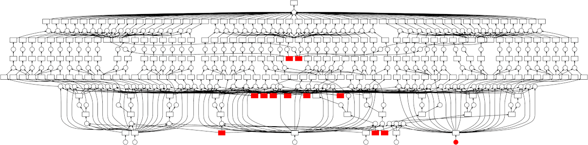

## Collaborative software-development in scikit-learn <!-- .element style="text-align: center; margin-left: 0px" -->

------

### Loïc Estève <!-- .element style="text-align: center; margin-left: 0px; margin-top: 50px" -->


<div style="text-align: center; margin-top: 50px">
  
</div>

==

## About me

<div style="float: left; width: 50%; padding-right: 50px">
BaBaR PhD, LHCb post-doc
</br>
<div class="fragment">PhD main achievement: </br>measure a cos and a sin +/- 0.8</div>
</div>

<div style="text-align: center margin-top: 120px" class="fragment">
    <div>Last 4 years</div>
    
    
    
    
</div>

==

# scikit-learn

--

## scikit-learn vision: an enabler

<div style="float: left; margin-right: 20px; width=25%">
    
</div>

Machine learning for everyone <!-- .element class="fragment" -->

High quality pythonic library <!-- .element class="fragment" --> 

Community-driven development <!-- .element class="fragment" -->

--

## Users


--

## Users (industry)


--

## Users (academia)

In Parietal: decode brain activity (fMRI)


Widely used in: astronomy, genomics, etc ...

--

## scikit-learn strengths

Easy to use:

```python
from sklearn import svm
classifier = svm.SVC()
svm.fit(X_train, y_train)
y_test = classifier.predict(X_test)
```

Consistent API for estimators <!-- .element class="fragment" -->

Optimised for speed: Numpy and Cython <!-- .element class="fragment" -->

<div class="fragment">
    Great documentation: [scikit-learn.org](https://scikit-learn.org)
</div>

<div class="fragment">
</div>

--

## Gallery of examples

[sphinx-gallery](https://sphinx-gallery.readthedocs.io/)


--

## Example


--

## API documentation <!-- .element style="margin-top: -50px" -->


--

## User guide


==

# Community

--

## Contributors


--

## Development process

* 2 core devs approvals to get a pull request merged <!-- .element class="fragment" -->
*  <!-- .element class="fragment" --> CIs in each pull request: **AppVeyor**
  (Windows), **Travis** (Linux), **CircleCI** (generate documentation),
  **codecov** (coverage, useful browser extension)<br/>
  
* daily tests against our dependencies development versions (numpy, scipy, ...):
  very useful to catch regressions or deprecated functionalities <!-- .element class="fragment" -->

--

## Project activity

~50 notifications per day from comments on PRs/issues


User support drowns core devs. Reviewing PR is the main bottleneck

[Road and Bridges](https://www.fordfoundation.org/about/library/reports-and-studies/roads-and-bridges-the-unseen-labor-behind-our-digital-infrastructure) by Nadia Eghbal

--

## Getting new contributors

* "good first issue" + "Easy" tags on issues <!-- .element class="fragment" -->
* talks/tutorials/sprints at conferences (PyCon, SciPy, EuroSciPy) <!-- .element class="fragment" -->
* one-week sprint organised every year with as many core devs as we can <!-- .element class="fragment" -->
* Google Summer of Code/"Mission d'école doctorale" <!-- .element class="fragment" -->

--

<div style="float: right">2015 & 2016</div>

## Funding & spending
 
New-York: 350 k$ More-Sloan grant<br/>
<small>
A. Mueller (full time). Students M. Kumar, V. Birodkar
</small>

Telecom Paris-Tech: 200 k€ WendelinIA grant + 12 k€ CDS<br/>
<small>
Programmers: T. Guillemot, T. Dupré. Students: M. Kumar, D. Sullivan, V.R.
Rajagopalan, N. Goix
</small>

Inria Parietal: 120 k€ Inria, + 100 k€ WendelinIA + 50 k€ ANR + 30 k€ CDS<br/>
<small>
Programmers: O. Grisel, L. Estève, G. Lemaître, J. Van den Bosche. Students:
A. Mensch, J. Schreiber, G. Patrini
</small>

** > 400 k€ / year**

--


## scikit-learn contrib

http://contrib.scikit-learn.org

Not everything can (and has to) go in scikit-learn <!-- .element class="fragment" -->

For cutting-edge algorithms, quick development, maturation <!-- .element class="fragment" -->

nice template to start the project (testing, CIs, ...) + visibility <!-- .elementclass="fragment" -->

requirements: follow the scikit-learn API, docs, tests <!-- .element class="fragment" -->

10 projects in scikit-learn contrib currently <!-- .element class="fragment" -->

--

## Scikit-learn foundation @ Inria


Launched 2 weeks ago

companies: better visibility for software they rely on, good for Public Relations

scikit-learn: permanent staff ("CDI") to consolidate project, useful feed-back from users

See [blog post](http://gael-varoquaux.info/programming/a-foundation-for-scikit-learn-at-inria.html)

--

## Python scientific stack


Someone else may solve your problems
<small>One advantage of being part of the very dynamic Python ecosystem</small>

--

## dask <!-- .element style="margin-top: -50px" -->


High-level interfaces: collections with an interface very similar to numpy/pandas
<small>Use case: pandas dataframe bigger than RAM</small>


Low-level interfaces for parallel computing


Other goodies:
* live diagnostic dashboard
* statistical profiler

Try dask in your browser via
[binder]((https://mybinder.org/v2/gh/dask/dask-examples/master?urlpath=lab)

--

## dask-related projects  <!-- .element style="margin-top: -50px" -->

[dask-ml](http://ml.dask.org/): fit scikit-learn models on data bigger than RAM, or parallelising scikit-learn on a cluster. Integration with xgboost.

[dask-jobqueue](https://docs.dask.org/en/latest/setup/hpc.html): smoothly
transition your *existing* Python code from your machine to a HPC cluster (SLURM, PBS, etc ...)

```python
from dask_jobqueue import SLURMCluster
cluster = SLURMCluster(<slurm_specific>)
cluster.scale(4)  # 4 jobs

from dask.distributed import Client
client = Client(cluster)
# dask generic code agnostic to the cluster
```

Similar packages for running dask on
[Kubernetes](https://kubernetes.dask.org/en/latest/) or on a
[Hadoop/Yarn](https://yarn.dask.org/en/latest/) cluster.

==

## Question for the audience 

Lots of clever people in Particle Physics + well-organised and
reasonably well-funded field <!-- .element class="fragment" -->

Why not more activity coming from Particle Physics in the Python
open-source space? <!-- .element class="fragment" -->

Contrast with Astrophysics (astropy) <!--
.element class="fragment" -->

Very interested to hear your thoughts on this! <!-- .element class="fragment" -->

--

## Possible answers

* I just haven't looked in the right places ... <!-- .element class="fragment" -->
* people are busy with Particle-Physics/experiment specific code + sharing/reusing code is hard <!-- .element class="fragment" -->
* Big experiments move slowly (with very good reasons) <!-- .element class="fragment" -->

==

<div style="float: right; width=25%; margin-top: -50px">

</div>

## Summary

<div>
<p>
**Vision**: Machine learning as a means not an end
</p>

<p style="font-size: 60%">
Versatile library: the right level of abstraction. Close to research, but seeking different tradeoffs
</p>
</div> <!-- .element class="fragment" -->

<div>
**Tool**: Simple API across learners

<p style="font-size: 60%">
Numpy arrays as data containers. Fast enough.
</p>

</div> <!-- .element class="fragment" -->

<div>
**Project**: Many people working together

<p style="font-size: 60%">
Ensure code quality and maintainability
</p>
</div> <!-- .element class="fragment" -->
