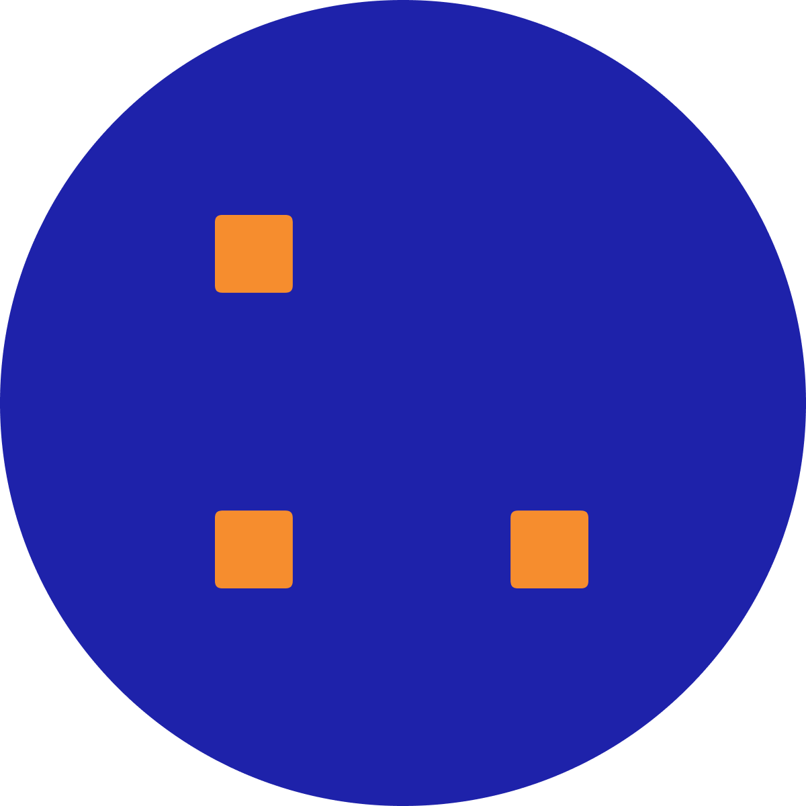
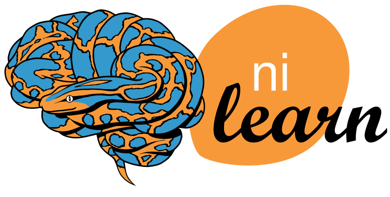
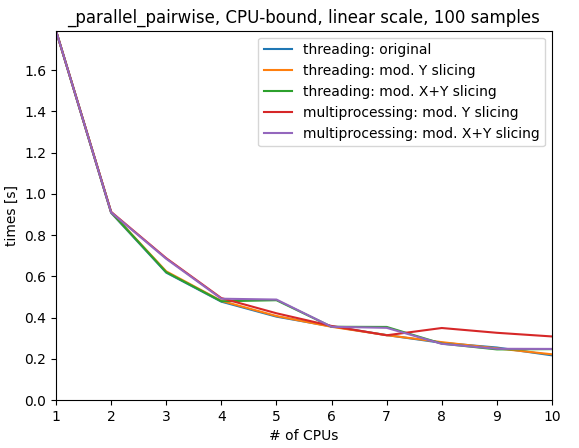

---
format:
  revealjs:
    theme: solarized
    width: 1280
    height: 720
    code-line-numbers: false
---

```{=html}
<p style="text-align: center">
<h1 style="text-align: center">
  CPython 3.13 free-threaded (aka nogil)<br/> in the Scientific Python ecosystem<br/>status and road ahead
</h1>
</p>
<h3 style="text-align: center; margin-left: 0; margin-top: 50px">
Loïc Estève
</h3>
<p style="text-align: center; margin-top: 5em">

<code>@lesteve</code>
</p>

<p style="text-align: center; margin-top: 50px">
  
  
</p>
```

## Quizz ✋

::: incremental

- you have heard about the GIL (Global Interpeter Lock)
- you wish the GIL can be removed one day
- you have already run CPython without the GIL

:::

## About me

<div class="fragment">Particle Physics background</div>
<div class="fragment step-fade-in-then-out" style="font-size: 80%">PhD main achievement: measure a cos and a sin +/- 0.8</div>

<div class="fragment">3 years in finance</div>
<div class="fragment step-fade-in-then-out" style="font-size: 80%">mainly C++ and as much Python as I could</div>

<div style="text-align: center margin-top: 120px" class="fragment">
  <div>10 years @ Inria open-source Python</div>
  
  
  
  
  
</div>
<div class="fragment">recently Probabl</div>

# Main message

<div class="fragment">
<center>
<h3>Join the free-thread union today!</h3>
  
  
</center>
</div>

. . .

CPython 3.13 free-threaded is already available, give it a go!

Development wheels from main Scientific Python packages available (numpy, scipy, pandas, scikit-learn, scikit-image, ...)

. . .

# Outline

::: incremental
- why should you care?
- status of the Scientific Python ecosystem
- road ahead?
- short history of scikit-learn free-threaded testing
:::

# Why should you care?

```{.python}
import numpy as np

arr = np.arange(1_000_000)

def func(arg):
    sum(arr)

%timeit [func(i) for i in range(20)]
# 848 ms ± 20.8 ms per loop (mean ± std. dev. of 7 runs, 1 loop each)
```

. . .

```{.python}
from multiprocessing.pool import ThreadPool

tp = ThreadPool(2)
%timeit tp.map(func, range(20))
# 840 ms ± 23.4 ms per loop (mean ± std. dev. of 7 runs, 1 loop each)
```

. . .

- GIL limits multithreading performance
- multiple historical attemps to remove the GIL
- first one that has a chance

## work-around: use multiprocessing

```{.python}
tp = Pool(2)
%timeit tp.map(func, range(20))
# 463 ms ± 6.1 ms per loop (mean ± std. dev. of 7 runs, 1 loop each)
```

. . .

```{.python}
from joblib import Parallel, delayed
results = Parallel(n_jobs=2)(delayed(func)(arg) for arg in range(20))
```

. . .

Limitations:

::: incremental

+ multi-processing overhead: pickling function, arguments and result + communication over socket
+ memory usage: semi-automatic memmapping in joblib
+ multi-processing overhead: auto-grouping short tasks in joblib
+ starting a process is slow: loky keeps processes around and reuses them
+ OpenMP not fork-safe and fork is the default start method: loky uses fork+exec
+ pickling: no support for lambda or interactively defined function (e.g.
  defined inside notebook): loky (through cloudpickle)
+ startup of multiprocessing can be expensive 64 processes hitting the
  filesystem for imports on a HPC cluster ~1 minute
+ ...

:::

## No such thing as a free-thread lunch

. . .

- different CPython `3.13t` (free-threaded, experimental) vs `3.13` (default)
- different wheels `cp313-cp313t`

. . .

- worse single-thread performance in free-threaded: expected ~10-15% worst case. May improve in the future

. . .

- probably some tricky threading-related issues (e.g. intermittent crashes or
  incorrect results) lurking and waiting to be found and fixed

# Status today

doc: <https://py-free-threading.github.io>

repo: <https://github.com/Quansight-Labs/free-threaded-compatibility>

## Install CPython 3.13rc1 free-threaded today

```bash
conda create -n nogil -c defaults -c ad-testing/label/py313_nogil python=3.13
```

package manager on Linux, python.org download, ...

<https://py-free-threading.github.io/installing_cpython/>

## Install the main scientific Python packages

```{.bash}
pip install \
    -i https://pypi.anaconda.org/scientific-python-nightly-wheels/simple
    scikit-learn
```

. . .

numpy, scipy, pandas, scikit-learn, scikit-image ...

. . .

Linux, MacOS probably, Windows not yet

. . .

<https://py-free-threading.github.io/tracking/>

## User report in scikit-learn

:::: {.columns}

::: {.column width="50%"}

`pairwise_distances` uses threading

- great for built-in scikit-learn distances
- not helpful with Python user function that holds the GIL

:::::: {.fragment}

Me: it would be great if you have time to try CPython free-threaded, it's already available, see doc

User:

> Good to know. I hope I will find some time to test it. I am really thrilled about it.

<https://github.com/scikit-learn/scikit-learn/issues/29587>
:::::

:::

::: {.column width="50%" .fragment}


:::

:::

# Road ahead?

free-threading the needle

> typically used as a metaphor, meaning to maneuver or find a way through a difficult situation


## PEP 703 acceptance

[PEP 703](https://peps.python.org/pep-0703/) accepted in July 2023

. . .

Direct quotes from
[notice](https://discuss.python.org/t/a-steering-council-notice-about-pep-703-making-the-global-interpreter-lock-optional-in-cpython/30474)
in October 2023:

. . .

Long-term (probably 5+ years), the no-GIL build should be the only build

. . .

Before we commit to switching entirely to the no-GIL build, we need to see community support for it

. . .

We want to be very careful with backward compatibility. We do not want another Python 3 situation

. . .

We want to be able to change our mind if it turns out, any time before we make no-GIL the default, that it’s just going to be too disruptive for too little gain

## Yes we can TL;DR 💪

> Before we commit to switching entirely to the no-GIL build, we need to see community support for it.

Great, let's help on this!

. . .

If we want to help making it happen, interest is best shown by putting work into it

. . .

> All the rest

not going to happen overnight, sure

. . .


## Testing strategies

running your package test suite is a start (maybe multiple times to have more chance to trigger issues)

- pure Python: not very likely to hit an issue but try it anyway
- Cython code: maybe fine (at least in scikit-learn case ... single issue fixed by using OpenMP lock)
- C/C++/Fortran code likely needs some work

. . .

more stress-testing is needed to find tricky threading-related issues<br/>
<https://github.com/Quansight-Labs/free-threaded-compatibility/issues/56>

- `pytest-repeat` on test functions that use threading
- pytest plugin to run tests in parallel using threading in the works
- using `ThreadSanitizer` on Numpy and see how helpful this is

. . .

## Testing strategy with joblib

use threading as default joblib backend

```{.python}
import joblib

# convenient for testing, not necessarily recommended in general ...
joblib.parallel.DEFAULT_BACKEND = "threading"
```

# History of nogil/free-threaded testing in scikit-learn

## Early days (2022)

::: incremental

- October 2021: Sam Gross announced Python 3.9 nogil fork on
  [python-dev](https://mail.python.org/archives/list/python-dev@python.org/thread/ABR2L6BENNA6UPSPKV474HCS4LWT26GY/)
  with pip-installable numpy, scipy, scikit-learn, etc ...
- mid-April 2022: Olivier Grisel reports a few teething issues (segmentation
  faults in numpy, scipy, cython) quickly fixed by Sam Gross
- single scikit-learn specific issue in KMeans: [fixed](https://github.com/scikit-learn/scikit-learn/pull/23159) by `with gil` => `omp_set_lock` in `.pyx` that uses OpenMP
- May 2022: nogil CI build with all scikit-learn test passing

:::

## nogil 3.9 fork days (2022-May 2024)

. . .

ran a few other projects tests: joblib, distributed, and reported issues

. . .

scikit-learn CI: a few issues from time to time but nothing really bad

. . .

very helpful answers/fixes from Sam Gross

. . .

July 2023: PEP 703 [accepted](https://discuss.python.org/t/pep-703-making-the-global-interpreter-lock-optional-in-cpython-acceptance/37075/38) by the PSF Steering Committee

. . .

October 2023: more [details](https://discuss.python.org/t/a-steering-council-notice-about-pep-703-making-the-global-interpreter-lock-optional-in-cpython/30474) PEP 703 acceptance by the SC

## CPython 3.13 beta days May 2024-now

::: incremental

- May 2024: CPython 3.13.0 beta 1 released

- numpy and scipy uploaded nightly Python 3.13 free-threaded wheels to
  [scientific-python-nightly-wheels](https://anaconda.org/scientific-python-nightly-wheels/repo)

- June 2024: scikit-learn free-threaded CI + development wheel uploaded to scientific-python-nightly-wheel
- most fixes in Sam Gross forks had been upstreamed, but lingering one in Numpy detected in scikit-learn CI:
  `RuntimeError: Identity cache already includes the item`<br/>
  <https://github.com/numpy/numpy/issues/26690>

:::

## A bit more stress-testing

scikit-learn tests with threading as joblib default backend, intermittent segmentation fault
```
[1]    1904131 segmentation fault (core dumped)
```

Minimal reproducer without scikit-learn:
```{.python}
# Some numbers work better than other to trigger the segmentation fault
from threadpoolctl import threadpool_limits
threadpool_limits(10, user_api="blas")

rng = np.random.default_rng(0)
L = rng.normal(size=(50, 50))
W_sr = rng.normal(size=50)

def func(i):
    cho_solve((L, True), np.diag(W_sr))

def create_multiprocessing_pool():
    # only triggers segmentation fault with multiprocessing 'fork' start_method
    Pool(2)

if __name__ == '__main__':
    create_multiprocessing_pool()

    tpe = ThreadPoolExecutor(max_workers=2)
    tpe.map(func, range(10))
```

# Conclusion

<div class="fragment">
<center>
<h3>Join the free-thread union today!</h3>
  
  
</center>
</div>

. . .

CPython 3.13 free-threaded is already available, give it a go!

Development wheels from main Scientific Python packages available (numpy, scipy, pandas, scikit-learn, scikit-image, ...).

. . .

How to help: setup CI for your package, try it on your use case and give feed-back

. . .

<https://py-free-threading.github.io>

#

##

- tension with Faster CPython project:
  <https://discuss.python.org/t/a-fast-free-threading-python/27903/45>
- some things are not thread-safe and won't be fixed for performance reasons
  e.g. calling next on iterator in different threads
  <https://github.com/python/cpython/issues/120496#issuecomment-2173660805>


