---
format:
  revealjs:
    theme: solarized
    width: 1280
    height: 720
    code-line-numbers: false
---

```{=html}
<p style="text-align: center">
<h1 style="text-align: center">
  PyPI in the face: running jokes that PyPI download stats can play on you
</h1>
</p>
<h3 style="text-align: center; margin-left: 0; margin-top: 50px">
Loïc Estève
</h3>
<p style="text-align: center; margin-top: 5em">

<code>@lesteve</code>
</p>

<p style="text-align: center; margin-top: 50px">
  
  
</p>
```

## About me

<div class="fragment">Particle Physics background</div>
<div class="fragment step-fade-in-then-out" style="font-size: 80%">PhD main achievement: measure a cos and a sin +/- 0.8<br/>(apparently some strong theoretical bounds on cos/sin 😅)</div>

<div class="fragment">3 years in finance</div>
<div class="fragment step-fade-in-then-out" style="font-size: 80%">mainly C++ and as much Python as I could</div>

<div style="text-align: center margin-top: 120px" class="fragment">
  <div>10 years @ Inria open-source Python</div>
  
  
  
  
  
</div>
<div class="fragment">:probabl for one year</div>

# PyPI in the face 🤔🥧?

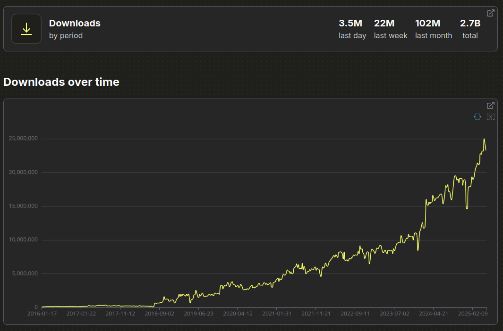

<small><https://clickpy.clickhouse.com/dashboard/scikit-learn></small>

## PyPI in the face 🤔🥧?

::: {.column width="30%" .fragment}

:::

::: {.column width="30%" .fragment}

:::

::: {.column width="30%" .fragment}

:::


# Useful websites/projects

## Google BigQuery PyPI dataset
<https://console.cloud.google.com/bigquery?p=bigquery-public-data&d=pypi&page=dataset>

Source of truth, [historical bug](https://pypistats.org/faqs#why-are-there-so-many-more-downloads-after-july-26-2018) until July 2018

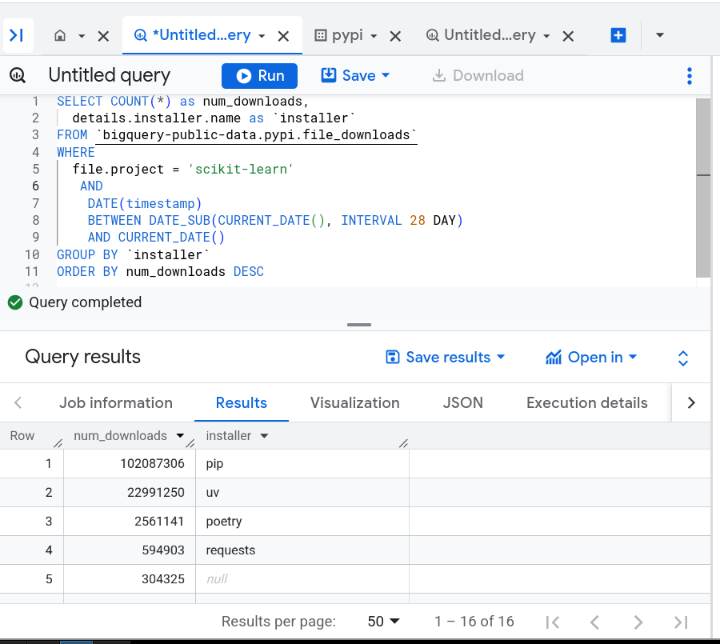

## clickpy

clickpy: <https://clickpy.clickhouse.com>
scikit-learn dashboard: <https://clickpy.clickhouse.com/dashboard/scikit-learn>

Copy and aggregation of the BigQuery DB. Historically there have been a few
bugs so may want to double-check with Google BigQuery.

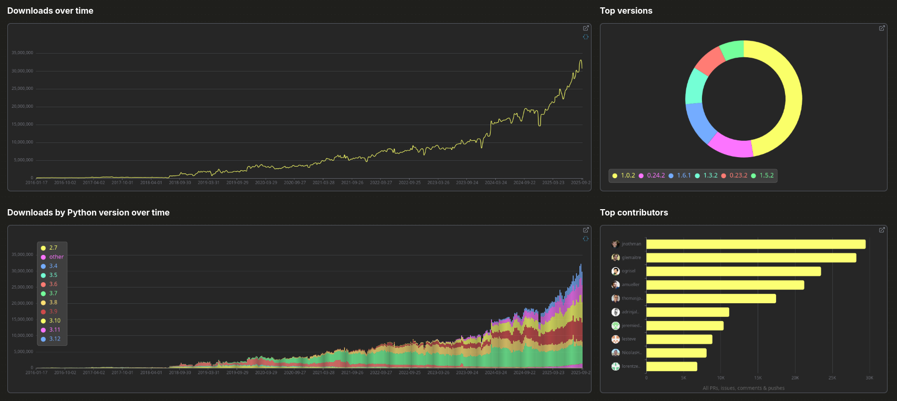

Can write your own SQL-like query to have more information

Open to change on their issue tracker (UI and "packages that needs refresh" wording)

maybe one day maybe: query + plots with Python using ibis on clickhouse DB

## PyPI stats

PyPI stats: <https://pypistats.org>
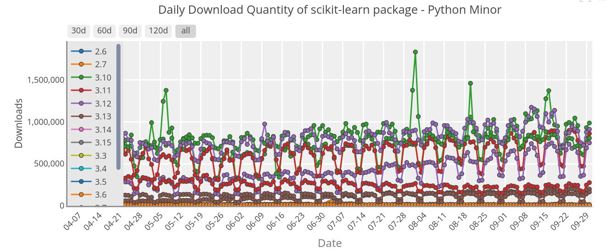

PSF has recently taken over the maintenance <https://github.com/crflynn/pypistats.org/issues/82>

Advantage: can tell with mirrors without mirrors only use pip in their aggregated numbers. No per-package version info.

## Pepy

Pepy: <https://pepy.tech> avantage can look at different version.

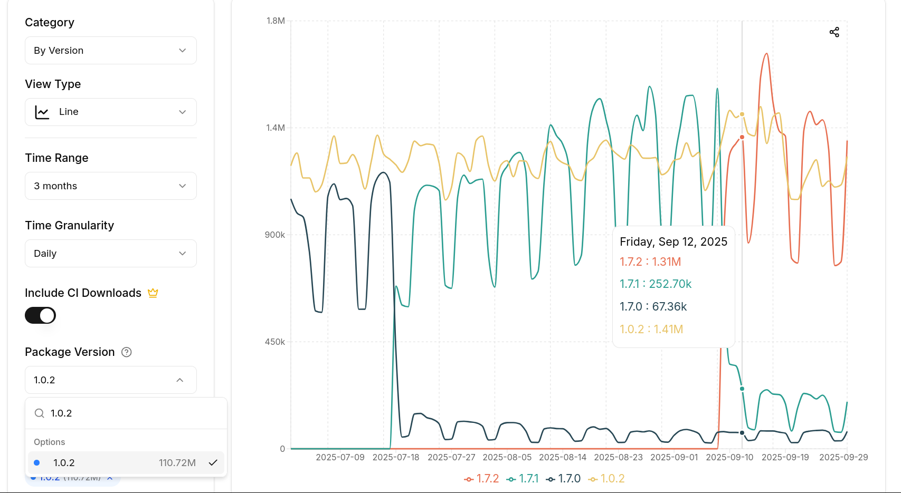

Aggregate numbers use Paid option for longer timeline CI. Download numbers are inflated compared to pypistats.org (more info later)

## top-pypi-packages

top-pypi-packages: <https://hugovk.github.io/top-pypi-packages>.

github repo with one json per month for most downloaded projects. No need to
write SQL query. Some small caveats query has changed a bit with time.

Hugo Van Keremade CPython developer with interesting blog posts on PyPI data

# PyPI downloads caveats 101

From [Python packaging user guide](https://packaging.python.org/en/latest/guides/analyzing-pypi-package-downloads/#background)

- `pip` has a local cache (`~/.cache/pip` on Linux)
- as a "normal" user `pip install my-package` only counts once (per `my-package` version) <small>(per Python version for package with compiled code)</small>
- mirrors (PyPI index clones) see [pypistats.org FAQ](https://pypistats.org/faqs#what-is-the-difference-between-without_mirrors-and-with_mirrors)
- "not particularly useful: Just because a project has been downloaded a lot doesn’t mean it’s good; Similarly just because a project hasn’t been downloaded a lot doesn’t mean it’s bad!"


# Caveat for newish packages: mirrors/installer type

## skore

::: {.column width="70%"}


the scikit-learn sidekick <https://github.com/probabl-ai/skore>

Talk by Marie Sacksick "Enhancing ML workflows with skore" next (11:25) in Gaston Berger
<!-- TODO have a graphical representation for result? -->

Most downloads are from mirrors / something else than pip, uv etc ...

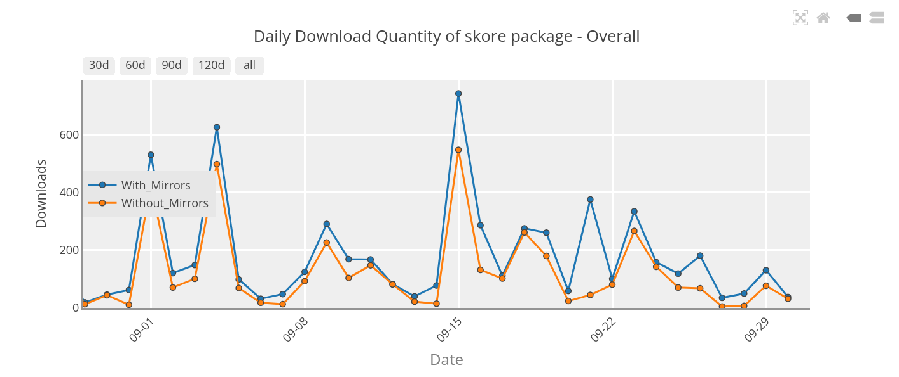
:::

::: {.column width="30%"}

<small>
March 2025

| installer    | downloads |
|--------------|-----------|
| bandersnatch | 771       |
| requests     | 402       |
| uv           | 336       |
| pip          | 306       |
| Browser      | 226       |
| NULL         | 173       |
| ...          | ...       |


June 2025

| installer    | downloads |
|--------------|-----------|
| pip          | 1811      |
| uv           | 814       |
| bandersnatch | 513       |
| NULL         | 258       |
| Browser      | 196       |
| requests     | 78        |
| ...          | ...       |

<!--

SELECT installer, SUM(count) as downloads FROM pypi.pypi_downloads_per_day_by_version_by_installer_by_type
where project == 'skore'
AND date > '2025-03-01' AND date < '2025-04-01'
GROUP BY installer
ORDER BY downloads DESC
LIMIT 6

-->
</small>

:::

installer type main source of discrepancy between different websites

pypistats.org only keep pip, others keep all installers

# scikit-learn

## scikit-learn

website statistics: 1.2M unique visitors per month<br/>
PyPI download stats: ~100M per month

. . .

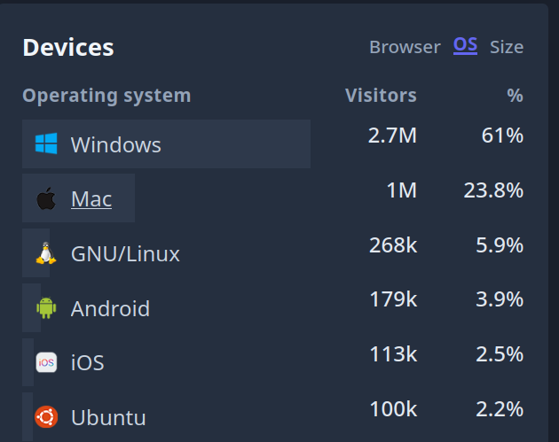
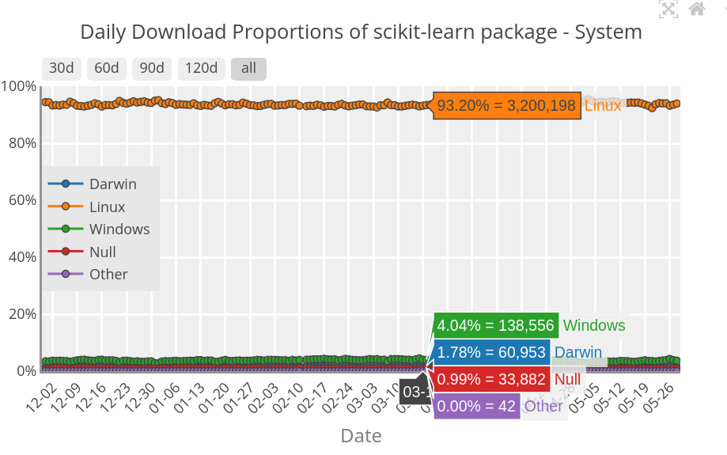


## scikit-learn most downloaded release

Most downloaded scikit-learn release in 2025 is 1.0.2 released on 2021 Christmas day

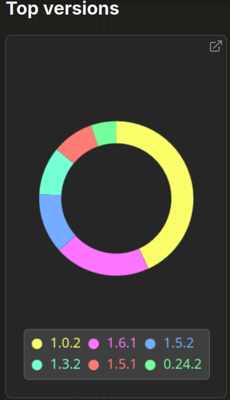
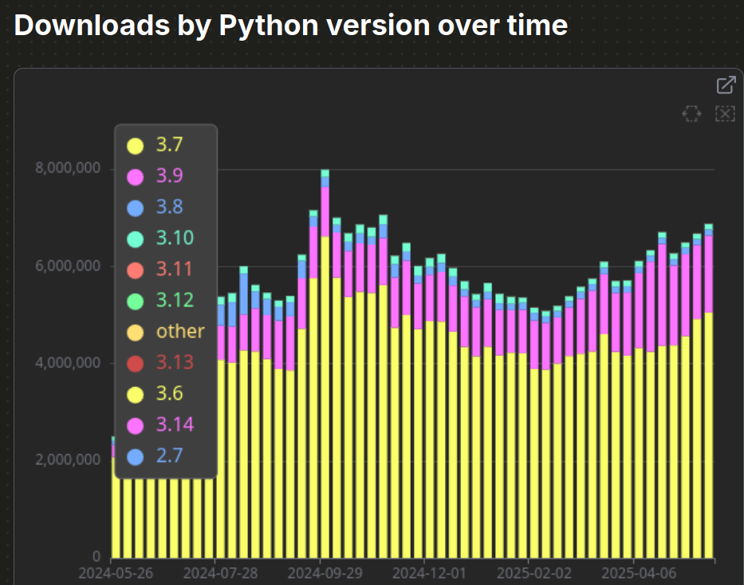

<small>Reminder: Python 3.7 EOL 2023-06-27</small>

<!-- ::: {.notes} -->
<!-- 1.0.2 was Christmas 2021 present. Maybe scikit-learn peak -->
<!-- ::: -->

## scikit-learn Python 3.7 investigation

Found out through [@hugovk blog post](https://hugovk.dev/blog/2023/why-are-there-still-so-many-downloads-for-eol-python-37/)

BigQuery dataset has Linux distribution and version

92.4% of Python 3.7 downloads come from Amazon Linux 2

<small>(Python 2 default, but you can install Python 3)</small>

. . .

Query run in May 2025 (over one day):

- 30% of scikit-learn downloads comes from Amazon Linux 2
- 50%+ of scikit-learn downloads comes from Amazon Linux (2 or 2023)

```
name                             version
Amazon Linux                     2             0.31
Amazon Linux                     2023          0.22
Ubuntu                           22.04         0.12
Debian GNU/Linux                 12            0.07
Ubuntu                           24.04         0.06
Ubuntu                           20.04         0.05
Debian GNU/Linux                 11            0.02
Ubuntu                           18.04         0.01
CentOS Linux                     7             0.01
```

## scikit-learn dependencies

scikit-learn depends on joblib

expectation: joblib is more downloaded than scikit-learn, right?

. . .

May 2025<br>
scikit-learn 102M<br>
joblib 87M

scikit-learn downloaded ~1.2x more than joblib 😱

. . .

<br/>
possible hypothesis, no guarantee whatsoever:

- some link to release frequency?
- use system joblib on Linux distribution but need more recent version of scikit-learn?
- install scikit-learn for multiple Python versions?
- pip backtracking. Pathological situation where pip starts downloading many scikit-learn versions to try to satisfy constraints

## scikit-learn dependencies: pip backtracking hypothesis

[pip backtracking doc](https://pip.pypa.io/en/stable/topics/dependency-resolution/#backtracking)

<div class="fragment step-fade-in-then-out">
  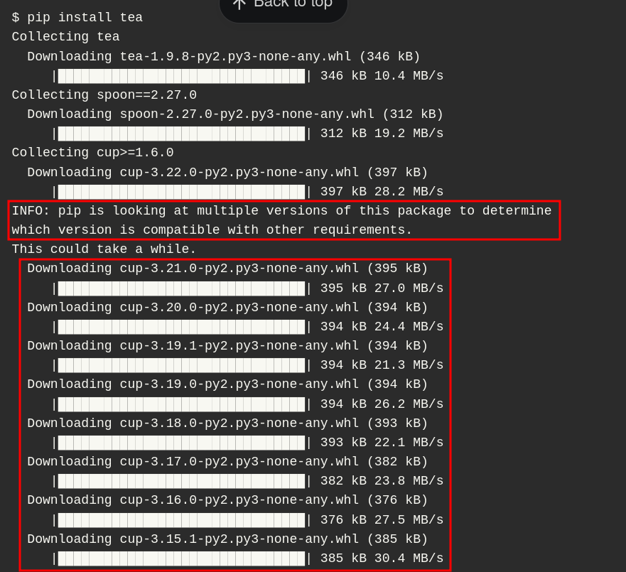
</div>

. . .

`conda`: joblib downloaded 1.2x more than scikit-learn

```
❯ condastats overall joblib scikit-learn scikit-learn --start_month 2025-03 --end_month 2025-07 --monthly
pkg_name      time
joblib        2025-03    2275295
              2025-04    2616275
              2025-05    2266739
              2025-06    2216331
              2025-07    2170978
scikit-learn  2025-03    1930584
              2025-04    2207607
              2025-05    1908129
              2025-06    1927962
              2025-07    1845839

```

Exercise left to the reader: `uv` should show a similar pattern because has a better constraint solver?

# sklearn

## sklearn context

`pip install scikit-learn` but `import sklearn`

Historical decision make `pip install sklearn` "just work", also avoid malicious actor taking the name
<br/>
<br/>

. . .

brownout strategy over one year (December 2022 - December 2023)
`SKLEARN_ALLOW_DEPRECATED_SKLEARN_PACKAGE_INSTALL=True` as last resort escape mechanism
<br/>
<br/>

. . .

Naive attempt to disable the cache broke poetry

one `sklearn` release roughly once per month 0.0.post3 for March 2023, 0.0.post5
for May, etc ...

PyPI stats seemed a good way to check that the brownout was working, right?

## sklearn data

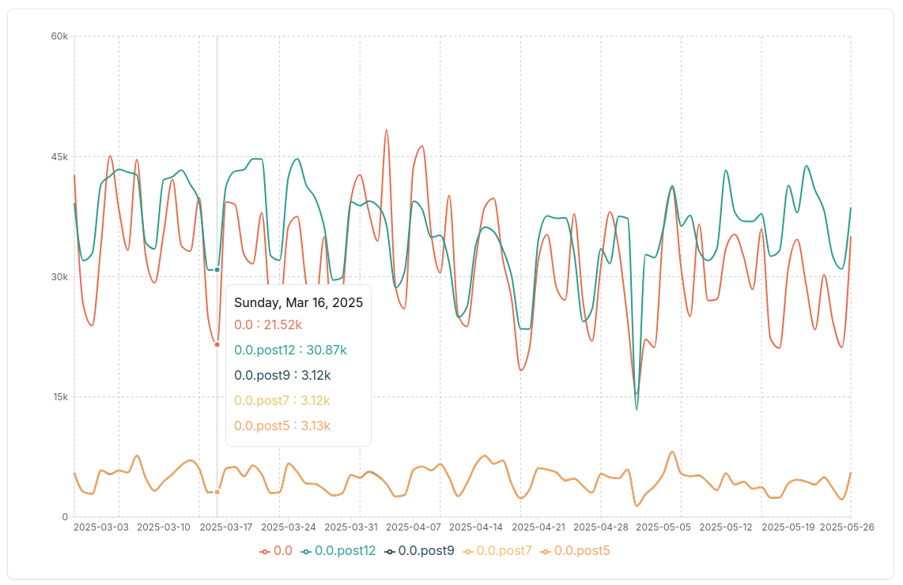

installer is mostly `pip` for `0.0.post5` and other transition releases, doen't
make much sense ...

# boto3 and friends

::: {.column width="40%"}
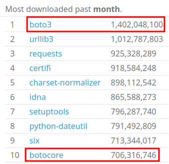
:::

::: {.column width="60%"}
boto3 x.y.z depends on `botocore>=x.y.z`

new release almost every day

similar inversion pattern for other boto3 dependents: `python-dateutil`

botocore cached but not boto3 seems weird
:::

# six

six is in the top 20 in most downloaded packages in 2025 (15 years after Python 2.7 EOL)

easy to misinterpret it: people still care about Python 2 compatibility

reality: python-dateutil still depends on six

plenty of popular packages depend on python-dateutil, boto3, pandas, etc ...

<!--
SELECT
        project,
        sum(count) AS downloads
    FROM pypi.pypi_downloads_per_day
    where date > '2025-01-01'
    GROUP BY project
    ORDER BY downloads DESC
    LIMIT 20
-->

# Separate "automated" vs "real" users?

- `details.ci` field only in Google BigQuery db
- based on environment variable `CI`, `BUILD_ID`, ...

scikit-learn: only 10-15% of the downloads are from CI

# Summary of what I learned

<!-- TODO work on this -->
- pay attention to installer type for newish/up-and-coming packages
- heavily influenced by cloud workflows (AWS in particular)
- dependencies being less downloaded than dependents doesn't make too much sense

Best highly hypothetical wild-guess

- automated cloud workflows
- regenerating Docker images from scratch?

# Half-baked thoughts about metrics
<!-- Goodhart's law  -->

<!-- Look I understand this is a prox metrics, we may not have anything better,
the big picture and everything etc ... but where do you draw the line -->

<!-- maybe it's only about clarifying intent, I am trying to make sense of this -->

<!-- arguments and counter arguments -->

<!-- truthometer from political fact checking with some statement example -->

## Metrics discussion

Goodhart's law: When a measure becomes a target, it ceases to be a good measure

Not everything that can be counted counts, and not everything that counts can
be counted (not Albert Einstein apparently)

Reality is complex => metrics help simplifying the message but sometimes gain
way too much importance and force people to play the metrics game IMO (e.g.
Shangai ranking for universities)

## Metrics discussion
<!-- TODO clean up -->
proxy metrics and big picture: I get it

numbers as a time-effective way to give credit to an opinion

bias: tend to stop looking when data matches the story you wanted to tell. Otherwise completely ignored.

Truth-O-meter in political fact-checking: mostly true, mostly false, pants on fire

Problem: fact-checking is always late to the party and never manages to correct wild claims/feel-good stories

## Personal opinion about PyPI stats usage

seems fair

- using PyPI download stats for grants/fuding agencies/investors
- looking at top downloaded packages to have an idea about adoption e.g.
  free-threaded wheel, pyproject.toml, Python 2 vs Python 3

OKish

- general trend to have a very rough idea (wouldn't read too much into it personally but 🤷)

misleading

- comparing two packages: this package is starting to catch up on this other one
- causal explanation: we did this and this is why downloads started to go up. Probably only a small part of the story

## In the end I know


. . .

But at least I tried a little bit 😅

# Conclusion

- I don't really understand the reality that the PyPI download metrics describe. Many unexplained caveats in the data.
- likely heavily biased by cloud workflows (AWS in particular)
- maybe (just maybe) we should refrain from bold claims based on PyPI data
- using proxy metrics and telling stories, why not, but maybe clarify intent and confidence level

#

# Other links

CHAOSS Practicioner about interpreting metrics: <https://chaoss.community/practitioner-guide-introduction/>
